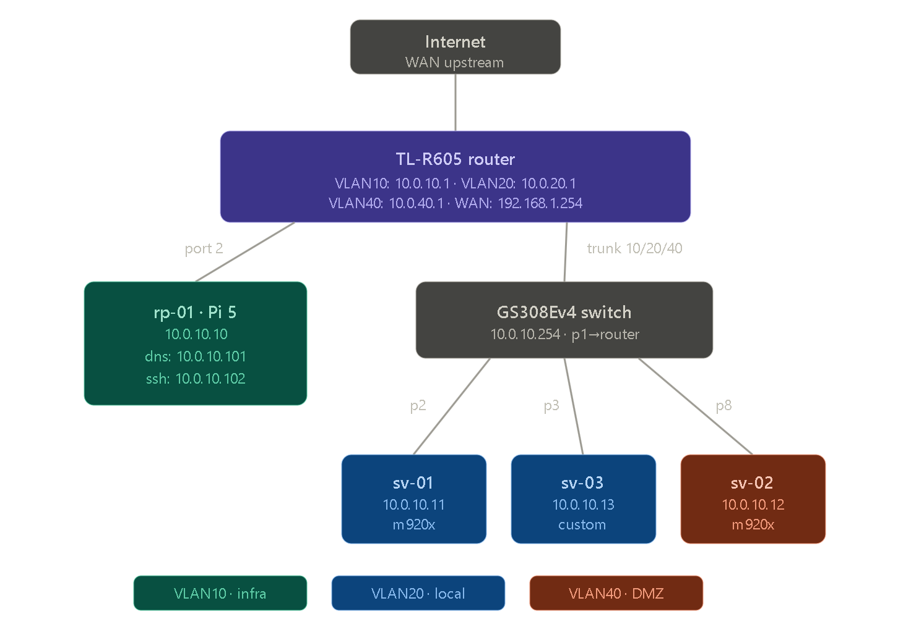

# Mi Homelab

**Documentación técnica de mi homelab basado en infraestructura Linux.**

Dominios: **dap.local** / **dap.gal**

!!! info
    Este documento actúa como **DRP (Disaster Recovery Plan)** del sistema.

---

# Arquitectura general

Infraestructura diseñada como un **mini datacenter**, con enfoque en:

- Alta disponibilidad (HA)
- Redundancia de datos
- Contenedores ligeros
- Infraestructura reproducible
- Bajo consumo

---

## Hardware

### Red

- Router: TPLink TL-R605
- Switch: NETGEAR GS308Ev4

---

### Cómputo

#### Nodo ARM

- Raspberry Pi 5
  - CPU: 4 cores ARM
  - RAM: 8GB
  - Expansión: M.2 HAT
  - Almacenamiento: 128GB SSD
  - Sistema: Raspberry Pi OS Lite

---

#### Cluster x86

- x2 Lenovo ThinkCentre M920x Tiny
  - CPU: Intel Core i3 (3.6GHz)
  - RAM: 16GB DDR4
  - SSD: 256GB
  - Hypervisor: ProxmoxVE

- x1 CustomPC
  - CPU: AMD Ryzen 5 5400G
  - RAM: 16GB (2×8GB 3200MHz)
  - SSD nvme: 256GB
  - SSD SATA: 2×1TB

---

### Almacenamiento

- NAS: *en construcción (comming soon...)*

---

# Esquema de red

## Infraestructura física (Baremetal)

| Dispositivo | IP            |
|-------------|---------------|
| Router      | 10.0.10.1     |
| Switch      | 10.0.10.254   |
| rp5-01      | 10.0.10.10    |
| srv-01      | 10.0.10.11    |
| srv-02      | 10.0.10.12    |
| srv-03      | 10.0.10.13    |
| nas-01      | 10.0.10.21    |

---

## Infraestructura virtual

### sv-01

| Contenedor | SO | Servicio | IP |
|-----------|----|----------|----|
| ct-home | Debian 13 | Homarr | 10.0.10.100 |
| ct-dns | Debian 13 | Pi-Hole | 10.0.10.101 |
| ct-stats | Debian 13 | Prometheus + Grafana | 10.0.20.101 |
| ct-n8n | Debian 13 | n8n | 10.0.20.111|

---

### sv-02

| Contenedor | SO | Servicio | IP |
|-----------|----|----------|----|
| webhost | Debian 12 | Nginx | 192.168.1.151 |
| git | Debian 12 | Gitea | 192.168.1.152 |
| pdf | Debian 12 | Stirling PDF | 192.168.1.153 |
| tv | Debian 12 | Jellyfin | 192.168.1.154 |
| music | Debian 12 | Navidrome | 192.168.1.155 |

---

### sv-03

| Contenedor | SO | Servicio | IP |
| webhost | Debian 12 | Nginx | 192.168.1.151 |

---

# Objetivo del sistema

Diseñar un **home datacenter eficiente y resiliente**, basado en:

- Bajo consumo energético
- Alta disponibilidad (HA)
- Redundancia de datos
- Escalabilidad horizontal

---

## Alta disponibilidad (HA)

El cluster se diseña para permitir failover automático entre nodos:

- srv01 ↔ srv02 replican servicios críticos
- Failover automático en caso de caída

---

## Quorum y tolerancia a fallos

Para garantizar HA se requiere un **quorum de 3 nodos**.

Como solución alternativa:

- RP5-01 actúa como **qdevice**
- Simula tercer voto del cluster
- Permite mantener quorum sin tercer servidor físico

---

!!! warning
    Sin quorum válido, el cluster no puede garantizar alta disponibilidad.

---

# Documentación externa

Canal de YouTube:

https://www.youtube.com/@davidalvarezp

Contenido:
- Setup completo del homelab
- Guías paso a paso
- Arquitectura y decisiones técnicas

---

# Requisitos del sistema

- Hardware 24/7
- Red cableada (Ethernet)
- Conocimiento de Linux

---

# Filosofía

- Sin abstracciones innecesarias
- Todo reproducible
- Stack 100% open-source
- Linux-first architecture

---